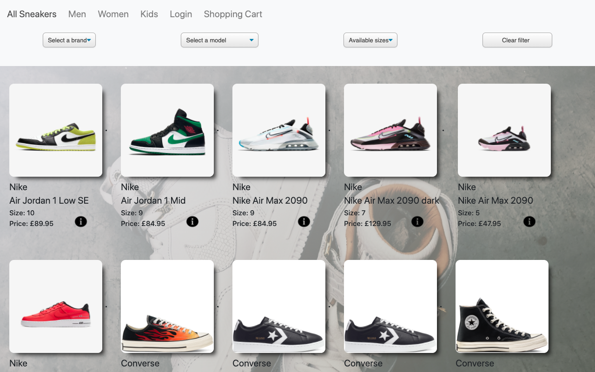
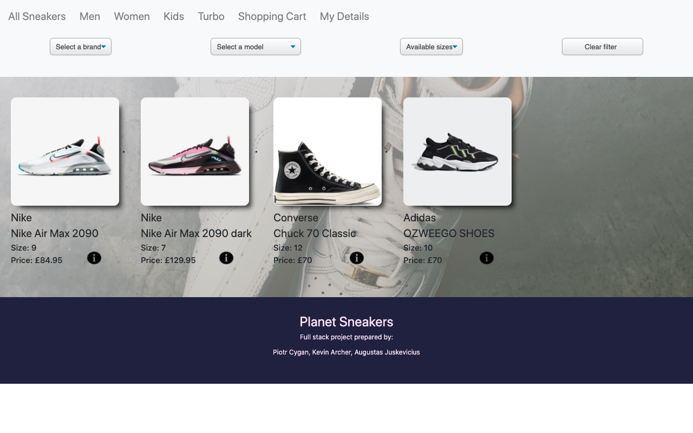
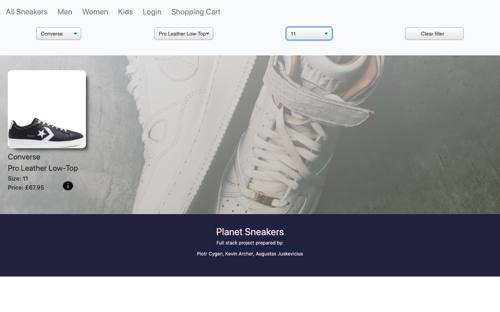
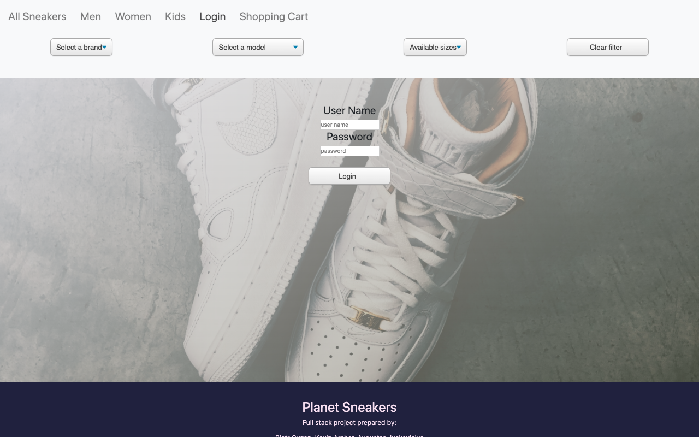
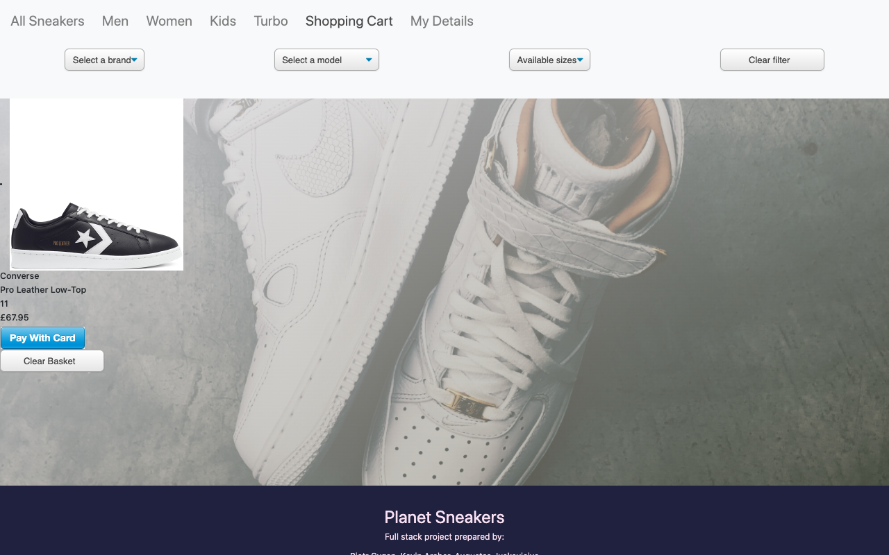
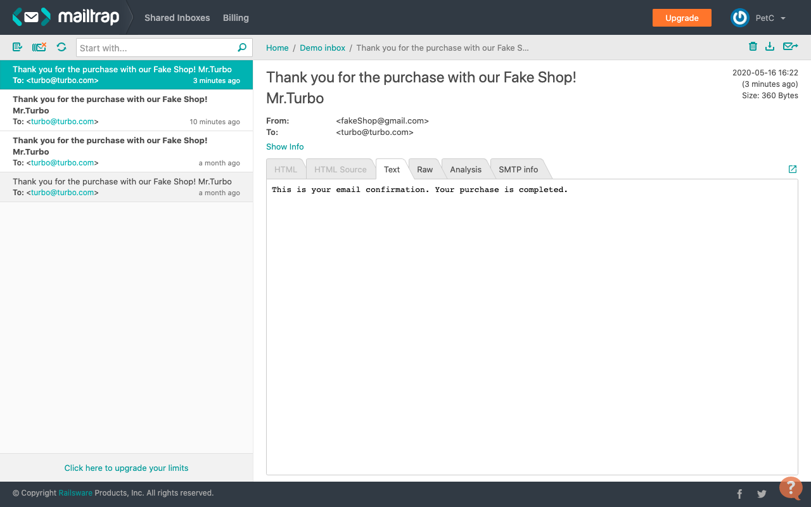

# Team Project Shop App

Sneakers online store created using JavaScript, React for the front end and using Java, Spring for the server. This app was designed to be as functional as in real life. Users are able to make payments via integrates sprite payments method. Users are also able to log in securely to our service and check purchase history or make new orders.
Once customer will make a purchase, confirmation email will be send automatically to their inbox.
#

### In our Navbar we are able to sort by sections(Men, Women, Kids)
### Example below is sorted by Women section.

### As standard Ecommecre shop our also can filter item by brand, model, size or combination of these(Below we can see filtered by all categories)

### Our shop allows users to log in to our service to keep customer information like orders or to make new purchase.

### Once our customer is ready to make a purchase we can add shoes to Shopping Cart and then make purchase. 

### At the end of purchase customer is able to see history of all orders that they made in our store by clicking My Details tab(this will only appear once customer is logged-In)
#
### Lastly our customer will receive an email confirmation.

